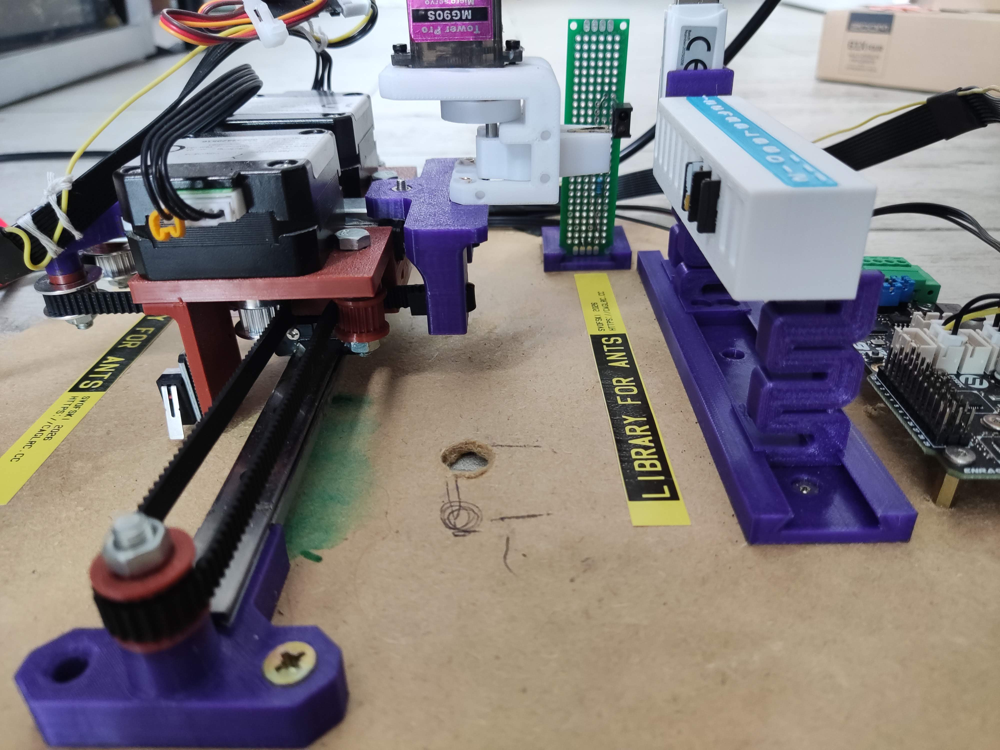
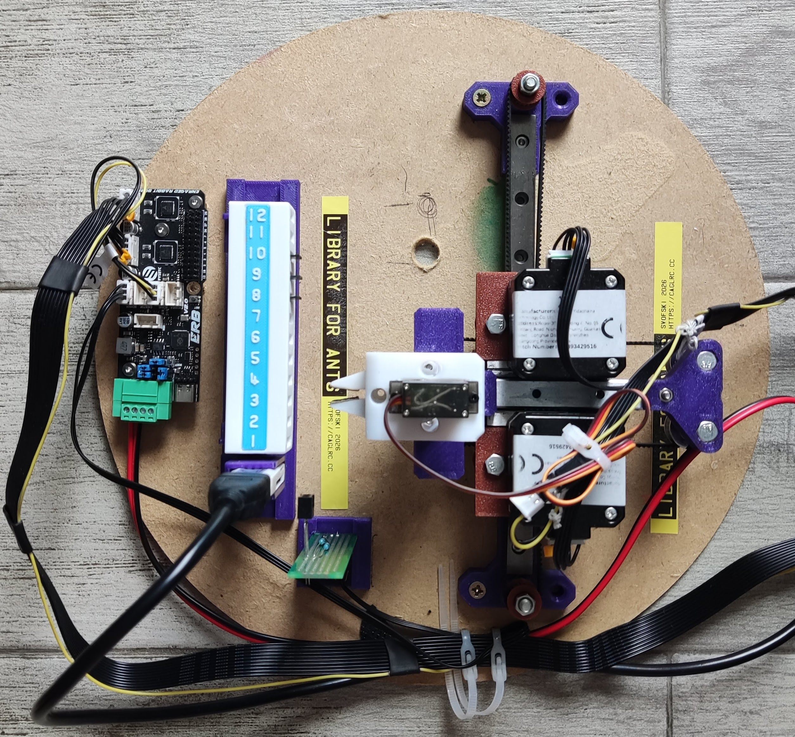
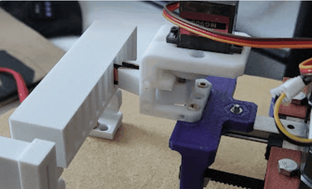

Library for ants
================
Robotic microSD card changer that wants to be a tape robot when it grows up

It's a microSD card changer. 

It can pick and insert one out of 12 cards in the magazine into a fixed microSD card reader.

The SD card is held using GRIPOR, which is an interesting project in itself.

GRIPOR
------
The gripper design files are [here](gripor)
There are two Gripors: the pliers version (used in Library for ants) and the parallel version. Both are tested and working.

Mechanics
---------
The mechanical parts are designed in FreeCAD. All CAD files are in the [cad](cad) folder.

Robotnik
--------
ERB firmware runs unmodified Klipper. The control program is written in Python using Textual. 
Some setup is needed to configure a fresh Linux to work with Klipper. 
The scripts are in the [scripts](scripts) directory. 

From experience, every distro needs a bit of persuasion them to work so they're only provided as hints.

References
----------

**Library for ants** would not be possible without previous work of other people to whom I owe my deepest respect.

Links to other projects that I borrwed ideas from:
 * https://www.buildlog.net/blog/2017/10/the-midtbot-a-new-flavor-of-h-bot/
 * https://github.com/bdring/midTbot_esp32
 * https://www.klipper3d.org/
 * https://textual.textualize.io/
